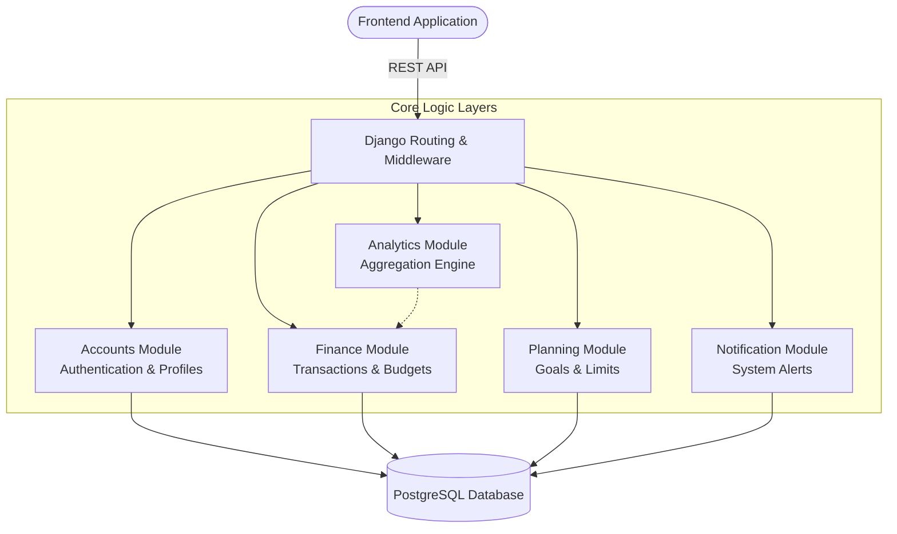

# System Architecture

The BudgetWise platform utilizes a modular Django architecture designed for separation of concerns, scalability, and maintainable data flows.

## Component Architecture

## Technical Specification

- **Framework**: Django REST Framework (DRF)
- **Database Architecture**: PostgreSQL (hosted on Supabase)
- **Static Assets**: WhiteNoise storage management
- **Documentation Standards**: OpenAPI 3.0 via drf-spectacular
- **Deployment Architecture**: WSGI-compliant hosting via Vercel

## Project Structure

The repository is organized into distinct functional applications:

| Directory | Responsibility |
|-----------|----------------|
| `Core/` | Global project configuration and routing |
| `accounts/` | Identity management and authorization |
| `finance/` | Core ledger logic and budget management |
| `planning/` | Future-state objectives and savings targets |
| `analytics/` | Data processing for reports and insights |
| `notifications/` | Event-driven alert dispatching |
